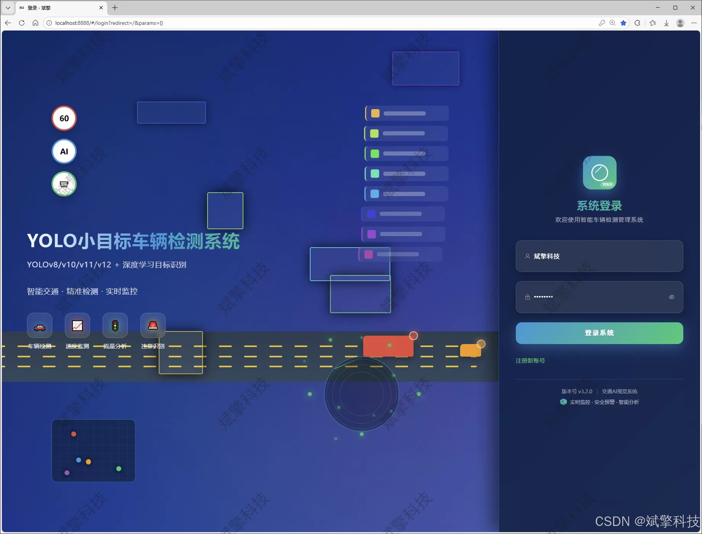
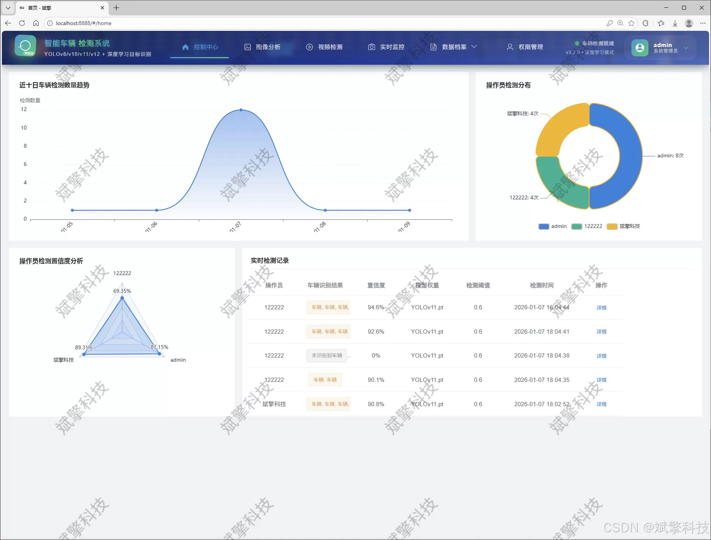
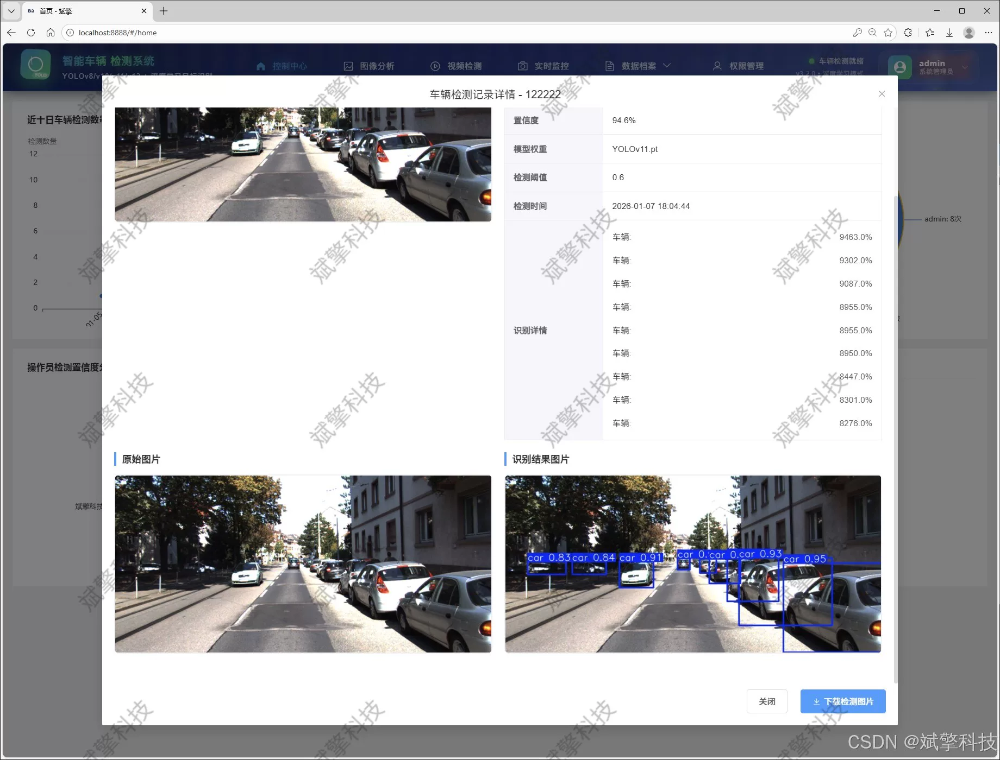
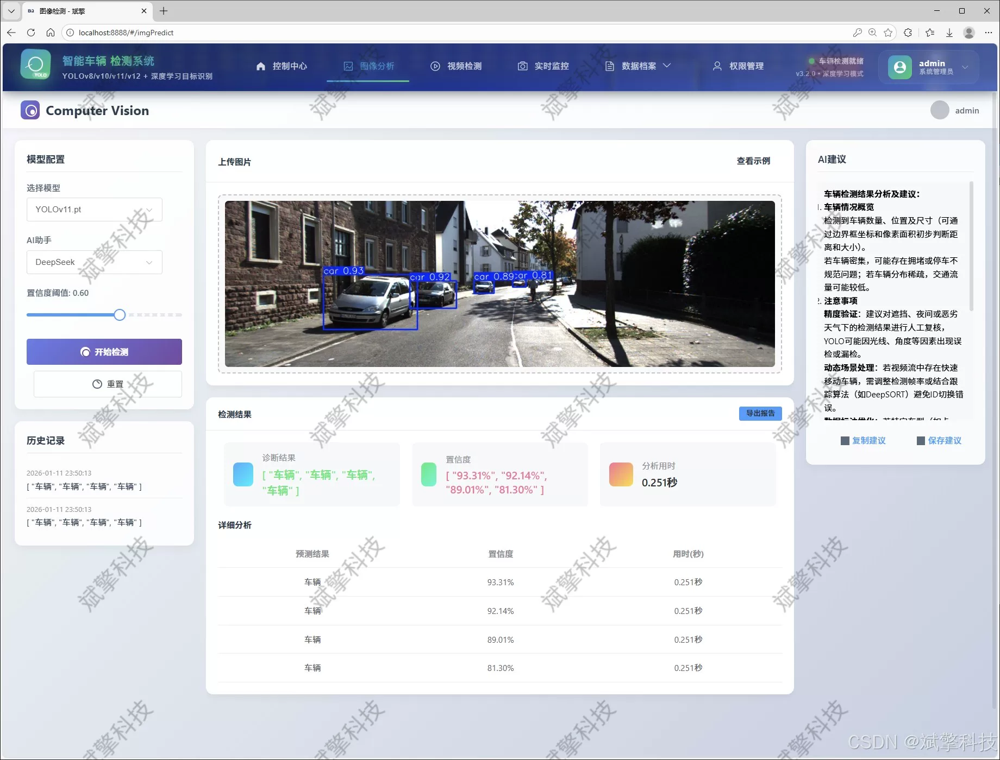
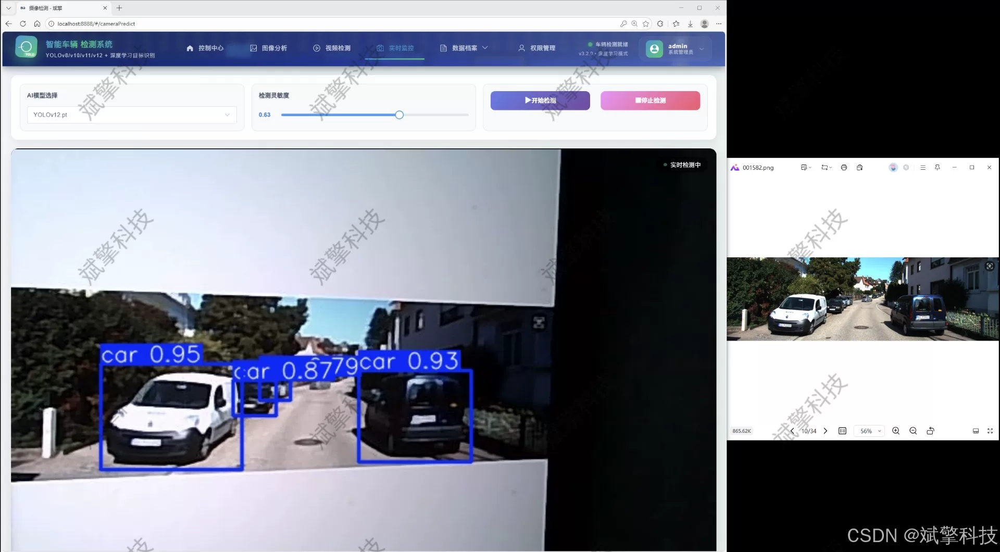
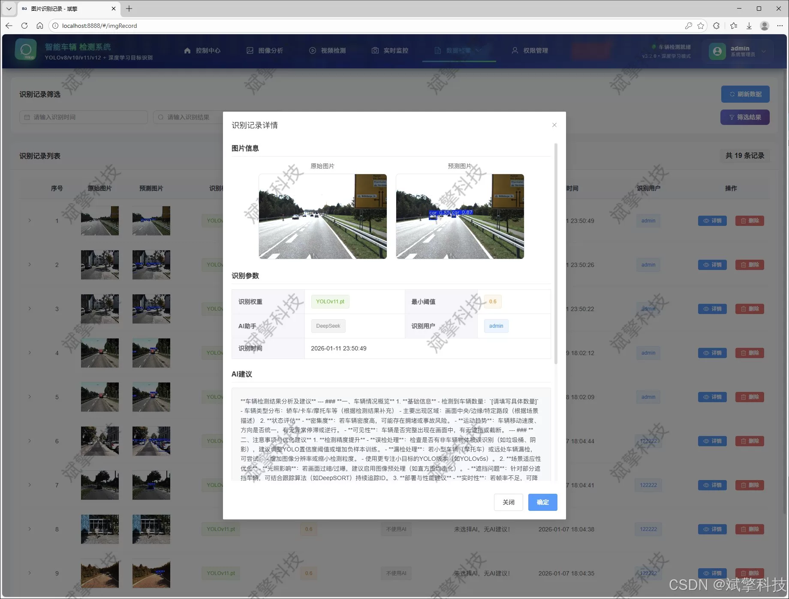
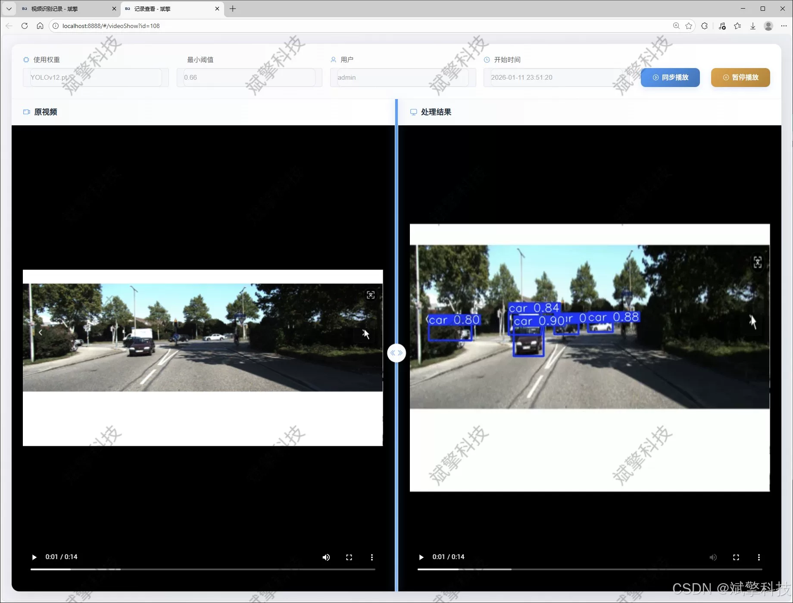
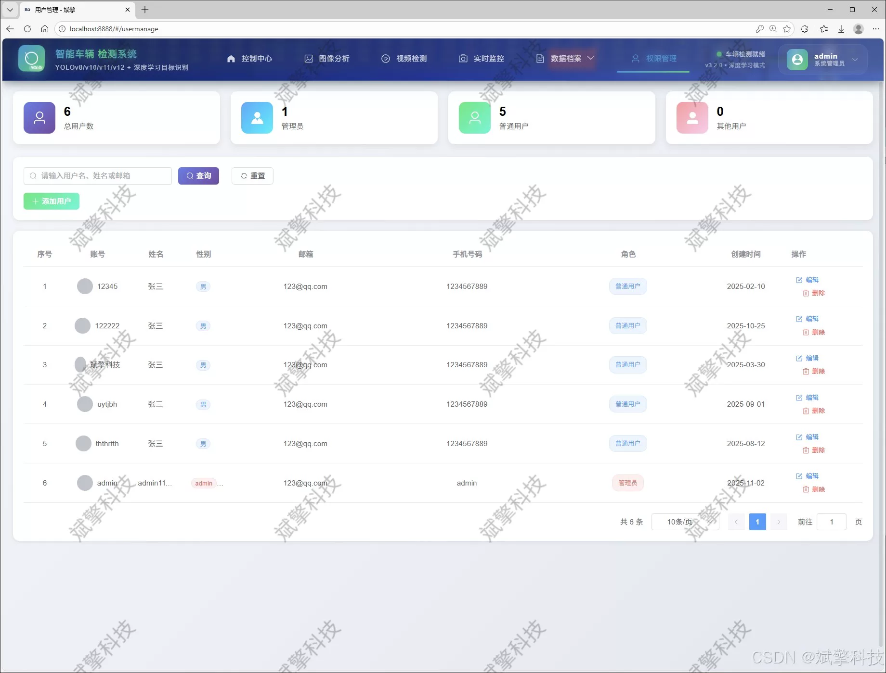
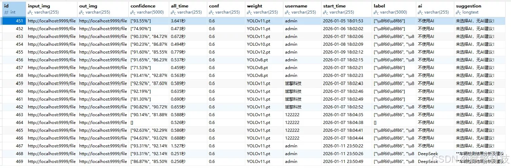

# YOLO-based Small Object Vehicle Detection System

## Body

YOLO-based small object vehicle detection system based on YOLO deep learning and large models such as Qianwen and DeepSeek. The system includes DeepSeek intelligent analysis, web interaction interface, front-end and back-end separation, YOLO data, and YOLOv8/YOLOv10/YOLOv11/YOLOv12.

The system core adopts the latest YOLO series model as the detection engine. By integrating and comparing with four high-performance versions of YOLOv8, YOLOv10, YOLOv11, and YOLOv12, it provides users with flexible and powerful capabilities for small object vehicle detection. The system's backend is built on the SpringBoot framework, adopting a front-end-back-end separation architecture pattern, ensuring high cohesion, low coupling, and good scalability. The front end provides an intuitive Web interaction interface, facilitating user operations and management.

The system features comprehensive functionality, encompassing a complete business process: user authentication and permission management (supports login registration, password detection, and MySQL storage), multimodal detection (supports image upload detection, video file analysis, and real-time camera stream detection), intelligent deep analysis (integrates the DeepSeek intelligent analysis module to perform secondary interpretation and content generation on detection results), full-process data management (all detection records and user operations are persistently stored in the MySQL database, providing interfaces for adding, deleting, updating, and querying). Additionally, the system includes a personal center and an administrator's backend, enabling self-management of user information and system-level control over users and content.

The dataset used in this project is specifically designed for small object vehicle annotation, including 5236 training images and 2245 validation images. The category is single 'car', ensuring the model's focus and effectiveness on small object detection tasks.

Functional module

✅ User Login and Registration: Supports password detection, saves to MySQL database.

✅ Supports four YOLO model switches, YOLOv8, YOLOv10, YOLOv11, YOLOv12.

✅ Information Visualization, Data Visualization.

✅ Image detection supports AI analysis functions, deepseek and Qianwen.

✅ Supports image detection, video detection, and real-time camera detection. The results are saved to a MySQL database.

✅ Picture recognition record management, video recognition record management and camera recognition record management.

✅ User Management Module, administrators can add, delete, modify, and query users.

✅ Personal center, can modify their own information, password name profile picture and so on.

There is no Lunwen writing service, nor any Lunwen.

## Images

## Payment

Here is a pay link on Stripe ( https://buy.stripe.com/3cs8yP7sY87d0vu9AB ). Please contact me lonlonago@foxmail.com after funding $89, and I will send you a complete data files , thank you!

